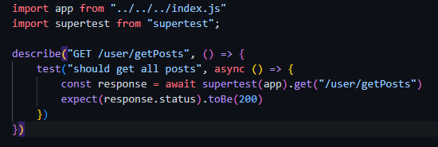
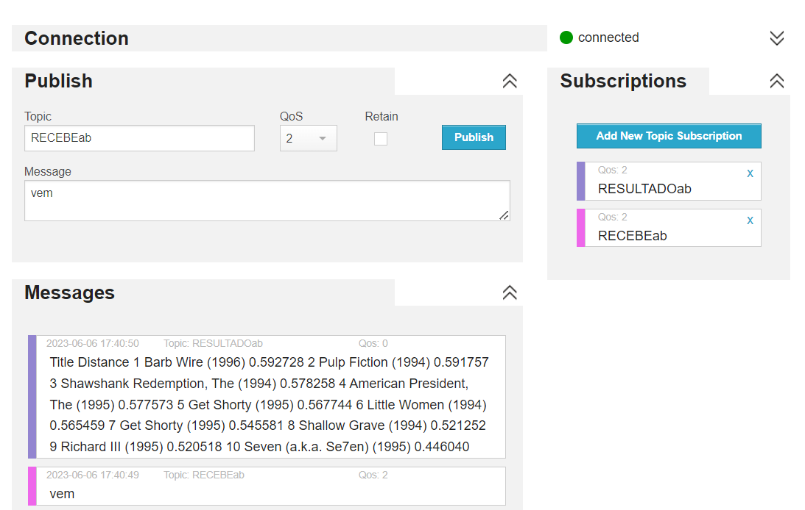

<table>
<tr>
<table>
<tr>
<td>

</td>
<td>
</td>
</tr>
</table>

# Nome do Projeto: TINAM App

# Nome do Parceiro: Dell

# Nome do Grupo: TINAM Dev's

# Integrantes do grupo

- Abner Silva
- Arthur Fraige
- Carolina Fricks
- Gabriel Nascimento
- Mike Mouadeb
- Sophia Tosar

# Módulo 6 - Engenharia de Software

## Elaboração de aplicação para dispositivos móveis.

> _Observação 1: A estrutura inicial deste documento é só um exemplo. O seu grupo deverá alterar esta estrutura de acordo com o que está sendo solicitado nos artefatos._

> _Observação 2: O índice abaixo não precisa ser editado se você utilizar o Visual Studio Code com a extensão **Markdown All in One**. Essa extensão atualiza o índice automaticamente quando o arquivo é salvo._

**Conteúdo**

- [Visão Geral do Projeto](#visão-geral-do-projeto)
  - [Parceiro de Negócios](#parceiro-de-negócios)
  - [Problema](#problema)
    - [Análise do Problema](#análise-do-problema)
    - [Matriz de Oceano Azul](#matriz-de-oceano-azul)
    - [Proposta de Valor e Value Proposition Canvas](#proposta-de-valor-e-value-proposition-canvas)
    - [Análise financeira do projeto](#analise-financeira)
    - [Mapeamento do Processo](#mapeamento-do-processo)
    - [Matriz de Risco](#matriz-de-risco)
  - [Descritivo da Solução](#descritivo-da-solução)
    - [Objetivos](#objetivos)
      - [ObjetivosObjetivos gerais](#objetivos-gerais)
      - [ObjetivosObjetivos específicos](#objetivos-específicos)
    - [Justificativa](#justificativa)
  - [Partes Interessadas](#partes-interessadas)
- [Requisitos](#requisitos)
  - [Mapeamento do processo em alto nível](#mapeamento-do-processo-em-alto-nível)
  - [Requisitos Funcionais](#requisitos-funcionais)
  - [Requisitos não Funcionais](#requisitos-não-funcionais)
  - [Casos de Uso](#casos-de-uso)
  - [Matriz de rastreabilidade](#matriz-de-rastreabilidade)
- [Arquitetura do Sistema](#arquitetura-do-sistema)
- [UX e UI Design](#ux-e-ui-design) -[Benchmarking](#benchmarking-e-revisão-de-design-systems)
  - [Wireframes](#wireframes)
  - [Design de Interface - Guia de Estilos](#design-de-interface---guia-de-estilos)
- [Gameficação](#gameficação)
- [Projeto de Banco de Dados](#projeto-de-banco-de-dados)
  - [Modelo Conceitual](#modelo-conceitual)
  - [Modelo Lógico](#modelo-conceitual)
- [Testes de Software](#testes-de-software)
  - [Teste Unitário](#teste-unitário)
- [Documentação da API](#documentação-da-api)
- [Construção da Base de Dados](#construção-da-base-de-dados)
- [Pipeline de Dados](#pipeline-de-dados)
- [Manual do Usuário](#Manual-do-usuário)
- [Referências](#referências)

# Visão Geral do Projeto

## Parceiro de Negócios

O Parceiro de Negócios desse módulo é a Dell, uma das maiores fabricantes de PCs do mundo. Atualmente, ela oferece uma ampla gama de produtos e serviços de tecnologia. Além disso, ela é muito conhecida por sua presença em soluções de infraestrutura de data center e serviços em nuvem.

Ademais, a empresa tem foco em inovação e design. Hoje em dia, a Dell continua sendo uma empresa líder em tecnologia e oferece soluções inovadoras e serviços de alta qaulidade para seus clientes em todo o mundo.

## Problema

O Problema que a Dell tem enfrentado é a retenção de talentos e a desmotivação de funcionários. A Dell espera obter um time mais engajado e motivado dentro da empresa. Por isso, o grupo TINAM Devs desenvolveu uma rede social para os funcionários da Dell.

Esse aplicativo, tem como objetivo motivar os funcionários da Dell por meio da oportunidade de fazer postagens, compartilhar conteúdos, participar de projetos oferecidos dentro da empresa e consequentemente, ser bonificado pde acordo com as interações feitas dentro do aplicativo.

## Descritivo da Solução
O aplicativo mobile de rede social para funcionários tem como objetivo engajar os colaboradores da Dell, fornecendo uma plataforma interna onde eles possam se conectar, compartilhar informações, colaborar, celebrar conquistas e fortalecer os laços dentro da organização. O aplicativo inclui recursos como perfis de usuários, feeds de notícias, processo de gameficação e até mesmo um ranking. 

Os Benefícios que essa solução vai fornecer para a empresa são diversos, e entre eles é possível citar: 
1- Aumento do engajamento dos funcionários, promovendo uma maior colaboração e um sentimento de pertencimento à empresa.
2- Melhoria da comunicação interna, permitindo o compartilhamento rápido de informações e ideias.
3- Facilitação da integração de novos funcionários, proporcionando uma forma mais fácil de se conectar com colegas.
4- Identificação de talentos e líderes emergentes.
5- Promoção de um ambiente de trabalho mais transparente e participativo.

## Partes Interessadas
As principais partes Interessadas nesse projeto são:

1- Funcionários, pois o aplicativo permite que eles se conectem com colegas de empresa que atuam em áreas diferentes, compartilhem conhecimento, e colaborem em projetos. Por fim, pode-se dizer que a plataforma vai estimular o engajamento dos funcionários e permitir que eles colaborem entre si.

2- Gestores: Os gestores da empresa também se beneficiam com o aplicativo, pois eles podem acompanhar as interações e o envolvimento dos funcionários, identificar talentos e líderes emergentes, promover a comunicação e o alinhamento de equipes, reconhecer e recompensar conquistas individuais e coletivas, além de obter insights valiosos por meio do feedback e das discussões realizadas na plataforma.

### Matriz de Oceano Azul

A Matriz de Oceano Azul é uma ferramenta de estratégia empresarial criada para identificar oportunidades de negócios em mercados inexplorados. Ela gera oportunidade para as empresas criarem novos espaços de mercado e cresçam de forma significativa e sustentável.
As imagens expõem a Matriz de Oceano Azul do grupo TINAM

Dessa forma, depois de analisar a empresa Dell antes e depois do produto que foi desenvolvido pelo grupo, é possível tirar algumas conclusões:

- O projeto vai aumentar praticidade para os funcionários da Dell
- O projeto vai aumentar as tecnologias da Dell
- O projeto vai eliminar a dificuldade de alocação dos funcionários
- O projeto vai aumentar a estética das tecnologias da Dell
- O projeto vai aumentar a durabilidade dos funcionários na empresa
- O projeto vai aumentar a qualidade da equipe de funcionários da Dell
- O projeto vai aumentar a experiência do cliente
- O projeto vai criar inovação na empresa Dell.

### Proposta de Valor e Value Proposition Canvas
O Canvas de Proposta de Valor é uma ferramenta visual que ajuda a entender as dores do público, auxilia na descoberta dos problemas que esse consumidor enfrenta e como o produto pode ajudar a resolvê-los. Ou seja, relaciona as necessidades e dores do perfil do cliente ao produto ou serviço criado de forma a apresentar as soluções como ‘aliviadores de dor’.
Dessa forma, o grupo TINAM desenvolveu um Canva Proposta de Valor para medir o quanto o nosso aplicativo irá agregar na empresa Dell. É possível observar a Proposta de Valor na imagem abaixo:

### Matriz de Risco

A matriz de riscos é uma ferramenta de análise de riscos que ajuda a identificar e priorizar os riscos em projetos.
A Imagem abaixo apresenta a Mateiz de Riscos realizada para esse projeto.

### Análise Financeira

A análise financeira de um projeto é essencial para ajudar os gestores a tomar decisões informadas sobre o investimento do projeto. Logo, de acordo com os dados obtidos nessa análise, é levado em consideração se o projeto poderá ou não trazer lucros para a empresa.

A seguir, encontra-se o link para acessar a análise financeira realizada pelo grupo TINAM Devs.

https://docs.google.com/document/d/16Y3fO-OvyRv0n_pdTYwdQThtXdSX4TZi7Df-IhWQdBc/edit

### Mapeamento do Processo
O mapeamento de processos é uma técnica utilizada para representar visualmente e descrever de forma detalhada as etapas, atividades e interações envolvidas em um processo de negócio. Essa representação é feita através de diagramas ou fluxogramas, que mostram a sequência lógica das atividades, as entradas e saídas de cada etapa, os responsáveis pela execução de cada atividade, as decisões tomadas ao longo do processo, entre outras informações relevantes.

O objetivo principal do mapeamento de processo é compreender e analisar os processos existentes em uma organização, identificando possíveis gargalos, ineficiências ou oportunidades de melhoria. Ele também ajuda a padronizar a execução das tarefas, melhorar a comunicação entre as equipes, facilitar a gestão e o monitoramento dos processos, e promover a otimização contínua. 

# Requisitos

## Requisitos Funcionais

Esta seção da documentação do software fornece uma descrição detalhada dos requisitos do sistema. Ela inclui informações sobre as funcionalidades esperadas do software, as restrições e limitações do sistema e outras especificações relevantes.

- O sistema deve possuir uma lista de conteúdo (documentários e projetos)
  disponíveis na página inicial.
- O sistema deverá ter uma barra de busca para procurar conteúdo.
- O sistema permitirá ao usuário publicar, editar , solicitar para participar e excluir conteúdo.
- O sistema deve permitir que o usuário o acesso com o email da Dell.
- O sistema deve permitir que o usuário navegue pela aplicação.
- O sistema deve ter um ranking que lista os usuários mais engajados.
- O sistema deve fornecer meios para o líder do projeto aceitar ou negar requisições de candidatos do projeto.
- O sistema deve permitir a visualização de perfis de outros usuários.
- O sistema deve notificar o usuário sobre os conteúdos que são relevantes para o usuário.

## Requisitos não Funcionais

Descreve os recursos necessários para sua execução, os requisitos de segurança e privacidade.

- O sistema deve seguir as normas da LGPD, permitindo o acesso apenas para funcionários da Dell.
- O sistema deve seguir a paleta de cores e fontes da Dell.
- O sistema deve ter a aplicação em inglês
- O sistema deve ser capaz de aguentar grande número de usuários e conteúdos.
- O sistema deve funcionar corretamente na plataforma mobile.
- O sistema deve possibilitar que o usuario de forma fácil aplique para a vaga proposta pela inteligencia artificial.
- O sistema deve ser capaz de enviar notificações para o usuário de eventos desejados.
- O sistema deve fornecer uma área de visualização de todos os participantes que se candidataram às vagas dos projetos gerindo de forma eficiente.
- O sistema deve notificar o lider de projetos caso o projeto tenha sido aprovado
- O sistema deve fornecer a opção de ver os comandos de aprovar ou desaprovar todas as propostas de projetos da equipe gerindo de forma segura.
- O sistema deve armazenar e mostrar todo o histórico de projetos cadastrados na plataforma
- O sistema deve oferecer a opção de cadastrar o projeto na plataforma para atingir novos participantes de forma simples e rápida.

## Casos de Uso

A seção de casos de uso da documentação de software é uma parte crucial que descreve as funcionalidades
do software e como elas serão utilizadas pelos usuários. Aqui, são listados todos os cenários possíveis de uso do software, incluindo as ações que o usuário pode realizar, as interações com o sistema e os resultados esperados. Os casos de uso são descritos em detalhes, incluindo a descrição do objetivo da funcionalidade, as entradas de dados, as ações do usuário e os resultados esperados. Além disso, também são incluídos os critérios de aceitação, que são os padrões que o software precisa atender para ser considerado como funcionando corretamente.

- Eu como funcionário da Dell, quero fazer postagens na plataforma.
- Eu como funcionário da Dell, quero me inscrever em novos projetos.
- Eu como funcionário da Dell, quero ler postagens dos temas que tenho interesse.
- Eu como funcionário da Dell, quero receber feedback do gestor do projeto no qual participei.
- Eu como líder de projeto, quero saber o interesse dos colaboradores que se inscreveram no meu projeto.
- Eu como funcionário da Dell, quero denunciar postagens que não fazem sentido pro aplicativo.
- Como funcionária da Dell, quero receber notificações sobre projetos de assuntos que tenho interesse.
- Como líder do projeto quero poder visualizar as vagas que já foram preenchidas.
- Como funcionário, desejo desmarcar como salvo por não ter mais interesse.
- Como usuário, quero visualizar minha posição em relação aos meus colegas, dentro do ranking geral de usuários
- Como usuário, quero buscar um projeto específico em uma barra de pesquisas
- Como funcionário da Dell, quero ter acesso a um tutorial, para aprender a usar a plataforma
- Como funcionário da Dell, quero visualizar o perfil de outros usuários.
- Como funcionário, desejo receber e visualizar as minhas notificação se fui aprovado para participar do projeto
- Como funcionário, quero vizualizar meu rank.
- Como funcionário da Dell, quero visualizar o meu perfil com as minhas informações registradas
- Como funcionário da Dell, quero ter acesso a opção de acessar o dashboard de projetos para gerenciar.
- Como funcionário da Dell, desejo visualizar todos os candidatos às vagas dos projetos que estou gerindo.
- Como funcionário da Dell, desejo editar o status do projetos criados por mim.
- Como funcionário da Dell, desejo excluir meus projetos criados
- Como funcionário da Dell , desejo vizualizar somente os projetos criados por mim.
- Como funcionário da Dell, desejo aprovar ou rejeitar a participação dos candidatos.
- Como funcionário da Dell, desejo receber e visualizar as minhas notificação se o meu projeto foi aprovado ou rejeitado

## Matriz de rastreabilidade

A matriz de rastreabilidade, é uma ferramenta utilizada para acompanhar e documentar a relação entre diferentes itens ou elementos ao longo de um projeto ou processo. Essa matriz estabelece uma ligação entre os requisitos, funcionalidades, componentes, testes, casos de uso ou outros elementos relacionados, permitindo rastrear as interdependências e garantir que todas as partes estejam devidamente cobertas e atendidas.

(https://docs.google.com/spreadsheets/d/12dbTVegm-uH6M-8SOcBtjQVkdFnjaft-R1v4uMoWH3o/edit?usp=sharing)

# Arquitetura do Sistema

A arquitetura da solução, é uma descrição abrangente da estrutura e organização de uma solução de software ou sistema, incluindo seus componentes, relacionamentos, interfaces, padrões de comunicação e fluxo de dados. Ela fornece uma visão de alto nível da solução e define a maneira como os diferentes elementos se conectam e interagem para atender aos requisitos do sistema.

Arquitetura do sistema 1.0

## Diagrama de fluxo

Diagrama de fluxo 1.0

## Arquitetura de Mensageria

A arquitetura de mensageria é um modelo de design para sistemas que se comunicam por meio de mensagens. A ideia por trás dessa arquitetura é separar as partes do sistema que produzem mensagens das partes que as consomem, permitindo que elas se comuniquem de maneira assíncrona e desacoplada.

  
## Arquitetura V2

  
## Arquitetura V3

  

# UX e UI Design

## Benchmarking e Revisão de Design Systems

O Benchmarking é uma técnica de gestão que envolve a comparação sistemática do desempenho da empresa com outras empresas que estão no mesmo setor de mercado. O seu objetivo é identificar as melhores práticas e processos usados pela empresa e aquilo que pode melhorar.

Nessa seção será apresentado o Benchmarking de Designs Systems referentes à Dell, IBM e Adobe.
(https://docs.google.com/document/d/17mJUcLigGvAFVsf1VpK_UhXA2e7wYPeR90jAvjpeL6U/edit)

## Wireframes

Telas de baixa fidelidade das áreas do usuário, conectados, demonstrando a diagramação e o fluxo de navegação

<h1>Versão 1.0</h1>

Sendo a versão incial ainda possui algumas telas para serem criadas e visualizadas, onde na próxima versão já estrão prontas de acordo com o nosso planejamento.

- Login : Tela de login, onde vai ser a tela onde terá a primeira interação com o usuário, principalmente com os usuários da Dell

 

- Home: Tela Home, onde será a segunda tela após o preenchimento das creedenciais no login, elá é a tela principal da aplicação, pois é a tela que mais tem interação, tanto com postagens ou sejá conteúdos sugeridos e também será possível ver os projetos presentes na plataforma

 

- Project page: Ainda seria a Home porem com a visualização dos projetos, tento tanto o foco em projetos abertos e fechados e de possivel aplicação a um projeto

 

- Profile : Tela de perfil, onde o usuário poderá visualizar as suas informações e seus projetos e também suas postagens

 

- Ranking : Tela de rank, onde é possivel visualizar a sua posição e a dos top 10 dentro da plataforma

<strong>Todas as telas foram pensadas para seguirem o DS da Dell disponibilizado nesse link: https://www.delldesignsystem.com/, por esse motivos todos os icones, modelos de imagem, margins, grids e etc estão tentando seguir o DS da Dell, por esse motivo estamos criando telas com o modelo do Twitter, além de se tornar algo familiar para os usuários, facilitada no aprendizado da utilização do aplicativo, além de querermos trazer um ambiente saudavel e agradavel para aqueles que tem interrese em navegar pela área tech.</strong>

<h2>Fluxo de navegação</h2>

<h3>Link Figma:</h3>

https://www.figma.com/file/DUPhcHeSxuH0VSe4csEKtS/mobile?node-id=1%3A2&t=lskHFxYTPBXZzf2U-1

## Design de Interface - Guia de Estilos

Refere-se ao design visual, cores, tipografia, imagens, logotipos, ou seja, os elementos visuais que compõem o produto.

<h3>Versão 2.0</h3>

 
 
 

<h4>Color Palette</h4>

O campo de palheta de cor é uma ferramenta importante para o projeto, pois é através dele que as cores são selecionadas e combinadas de forma harmoniosa para transmitir uma mensagem visual coerente. A palheta de cor é composta por um conjunto de cores que são utilizadas no projeto, e sua escolha deve ser feita com cuidado para que as cores escolhidas se complementem e sejam adequadas ao propósito do projeto.

<h4>Tipografia</h4>

A tipografia se refere ao estilo, tamanho, espaçamento e disposição das letras e dos caracteres utilizados em um projeto. A escolha da fonte deve ser feita com cuidado para que a tipografia seja legível e adequada ao propósito do projeto. Uma fonte mal escolhida pode prejudicar a legibilidade do texto, dificultando a leitura e a compreensão da mensagem.

<h4>Componentes UI</h4>

Os componentes de interface do usuário (UI) representam as partes interativas de um projeto de design, como botões, menus, barras de rolagem, campos de entrada, entre outros. Esses componentes são fundamentais para a funcionalidade do projeto, pois permitem que os usuários interajam com a interface de forma clara e intuitiva.

  
## Gameficação
 
 A gameficação é uma metodologia que utiliza elementos de jogos para atrair os usuarios em ambientes que não se resumem a entreterimento. O TINAM App vai utilizar a gameficação para gerar engajameno com  usuario.
Os pontos vão ser distribuidos da seginte forma: a cada projeto participado o usuario ganha 30 pontos e 15 coins. A cada like recebido no post aumenta 2 pontos e a cada comentario 3 pontos. Já na temporada, os pontos de receber like e comentario são dobrados caso o post seja sobre o assunto que está em alta.
Os pontos vão impactar na posição do jogador no ranking. E as moedas podem ser usadas para comprar itens no shop do aplicativo. 

  
# Projeto de Banco de Dados

Documento contendo diagrama de entidades e relacionamentos do banco de dados

## Modelo Conceitual

O modelo Conceitual de um banco de dados é uma representação abstrata dos dados que serão armazenados e gerenciados pelo sistema de banco de dados. Ele descreve a estrutura dos dados e as relações entre eles, sem se preocupar com a implementação física do banco de dados.

O modelo Conceitual é importante porque permite que os desenvolvedores de banco de dados projetem e construam sistemas de banco de dados que atendam às necessidades dos usuários de maneira eficiente e eficaz. Ele ajuda a garantir que os dados sejam organizados de maneira coerente e que as informações sejam facilmente acessíveis quando necessário.

# Testes de Software

## Teste Unitário
Teste unitário é uma técnica de teste de software que tem como objetivo verificar o comportamento correto e isolado de unidades individuais de código, como funções, métodos ou classes. Essas unidades são testadas de forma independente, em um ambiente controlado, para garantir que elas funcionem corretamente e produzam os resultados esperados.

Dessa forma, o grupo TINAM fez diversos arquivos de testes unitários para garantir que a aplicação está funcionando. Logo, a escolha do grupo foi realizar um arquivo de teste para cada funcionalidade do aplicativo. Nas imagens abaixo estão as evidências dos testes realizados.

<strong>Teste GET posts</strong>

<strong> Teste GET Projects </strong>

<strong> Teste GET Post By Id </strong>

<strong> Teste Comment Post  </strong>

<strong> Teste Post Complain  </strong>

<strong> Teste Project Complain  </strong>

<strong> Login </strong>

<strong> Ranking </strong>

## Teste de Usabilidade

Link ou imagem da tabela com dados organizados dos testes realizados

# Documentação da API

A documentação da API, disponibilizada por meio do Swagger, é útil para explorar e entender os endpoints, quais são seus parâmetros e respostas fornecidas pela API. 
Para acessá-la, é necessário iniciar o backend executando o comando 'npm start dev' e, em seguida, acessar http://localhost:3000/api-docs para visualizar e testar toda a documentação gerada pelo Swagger.
  
# Construção da Base de Dados
Para a construção da Base de Dados o grupo decidiu pegar o dataset "Sistemas de Recomendação ICMC-USP" do Kaggle. Desse dataset  foram usadas duas tabelas, a "Movies" e a "Ratings". Na tabela "Movies" estavam presentes as colunas: movieId, title e genres. Já na Tabela "Ratings", as colunas presentes eram: movieId, userId, ratings e timestamp.
Ademais, após extrair essas duas tabelas do dataset, nós começamos a parte de transformação dos dados, para que eles ficassem mais apropriados para o nosso modelo. Dessa forma, o primeiro passo foi  realizar um "merge" dessas tabelas e logo em seguida retirar as colunas "title e "timestamp". 
Além disso, foi necessário a retirada dos filmes com o gênero "children", pois não faz sentido para o contexto atual a utilização de filmes infantis para o treinamento do modelo. Por fim, a coluna de gênero também foi extraida da Base de Dados.
Portanto, para fins estatísticos, o grupo fez dois gráficos para analisar melhor os dados presentes no dataset. O primeiro gráfico é respectivo à classificação dos filmes realizadas pelos usuários. Já o segundo, faz referência a quantidade de avaliações que cada filme possui.

O gráfico "Índice de Rating" nos mostra no eixo x as classificações dadas pelos usuários de 1-5. Já no eixo y, ele mostra a quantidade de avaliações realizadas. Dessa maneira, é possível concluir que as classificações que mais foram dadas aos filmes, foram as classificações 4 e 5.

 
 Por outro lado, o gráfico "Índice de MovieId" nos mostra no eixo x algums fimes que foram avaliados, e apresenta no eixo y a quantidade de vezes que esse filme foi avaliado. Portanto, é possível afirmar quea Base de Dados possui alguns filmes que foram muito mais avaliados do que outros, dessa forma esse é um ponto a ser observado durante o treinamento do modelo, pois esses outliers correm o risco de prejudicar a acurácia do Sistema de Recomendações.

# Pipeline de Dados 
A Pipeline de Dados segue o modelo ETL (Extração, Transformação e Carga). Esse moldelo é um método amplamente utilizado na área de tecnologia da informação para extrair dados de diversas fontes, transformá-los em um formato adequado e carregá-los em um sistema de destino, como um data warehouse ou um banco de dados.
 Dessa forma, é possível afirmar que a extração dos dados foi realizada de um dataset do Kaggle (Sistemas de Recomendação ICMC-USP), em que foram utilizada duas tabelas: a "movies" e a "ratings". Depois desse processo de extração, o grupo realizou um processo de transformação desses dados para que eles se tornassem mais favoráveis para o treinamento do modelo. E por fim, nós transformamos essa Base de Dados em um arquilo csv para que se torne possível a transferência desses dados para o banco de dados "MySQL"

  
  
# Testes finais de envio e consumos das mensagens.

MQQT é um protocolo de mensagens que foi criado com o objetivo de oferecer um baixo consumo de rede, banda e também dos demais recursos de software.

Nós conctamos nosso ambiente de trabalho (Colab) a um sistema MQTT. Dessa forma, nós pré-selecionamos um filme da base de dadis e utilizando o modelo KNN, foi calculado os dez filmes mais próximos.   
Logo, essa abordagem é útil para recomendação de filmes, pois permite encontrar filmes com características semelhantes ao filme que o usuário gosta. Isso pode ajudar a descobrir novos filmes que possam ser do  interesse do usuário com base em padrões encontrados nos dados.

Link para o manual do usuário, feito no canva: <a>https://www.canva.com/design/DAFmpcHgOpI/BEqBLmxYSDcvLO9XbZ2rrw/edit</a>

Na imagem acima podemos ver o resultado dessa conexão.  

# Manual do Usuário

Fornecer instruções detalhadas sobre como usar o software corretamente. É uma ferramenta valiosa para ajudar os usuários a compreender as funções do software, instalar o software, configurar as preferências do usuário, entre outras tarefacom o modelo de recomendaçãs. O manual do usuário geralmente inclui screenshots, animações e outros recursos visuais para tornar a experiência do usuário mais clara e intuitiva. Além disso, ele também pode incluir informações sobre solução de problemas, dicas e truques, bem como informações de contato para suporte técnico. É importante que a seção de manual do usuário seja atualizada frequentemente para garantir que os usuários tenham acesso à informação mais recente e precisa sobre o software.

# Referências

1- React Native: Documentação. Disponível em: https://reactnative.dev/. Acesso em: 23 jun. 2023.
2- Express.js: Documentação em português. Disponível em: https://expressjs.com/pt-br/. Acesso em: 23 jun. 2023.
3- Dribbble: Showcase and discover creative work. Disponível em: https://dribbble.com/. Acesso em: 23 jun. 2023.
4- Prisma: The Database Toolkit. Disponível em: https://www.prisma.io/. Acesso em: 23 jun. 2023.
5- Unsplash: Beautiful Free Images & Pictures in Portuguese (Brazil). Disponível em: https://unsplash.com/pt-br. Acesso em: 23 jun. 2023.
